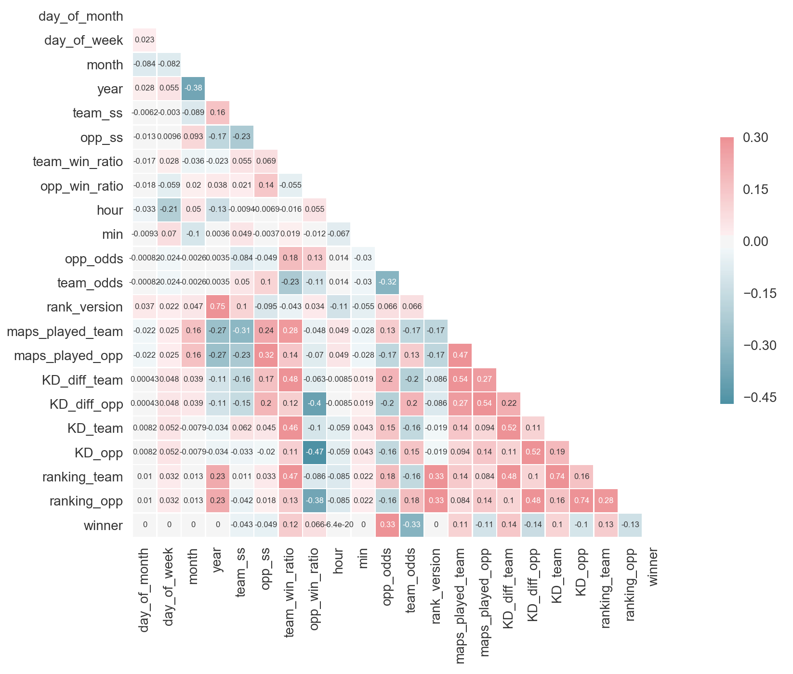
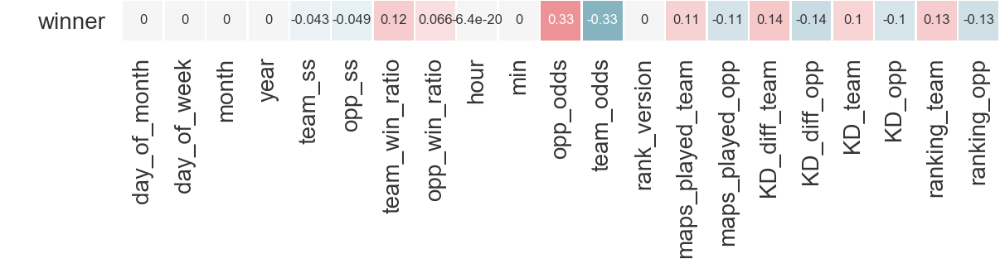
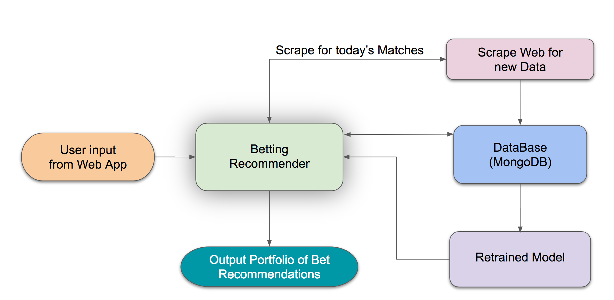
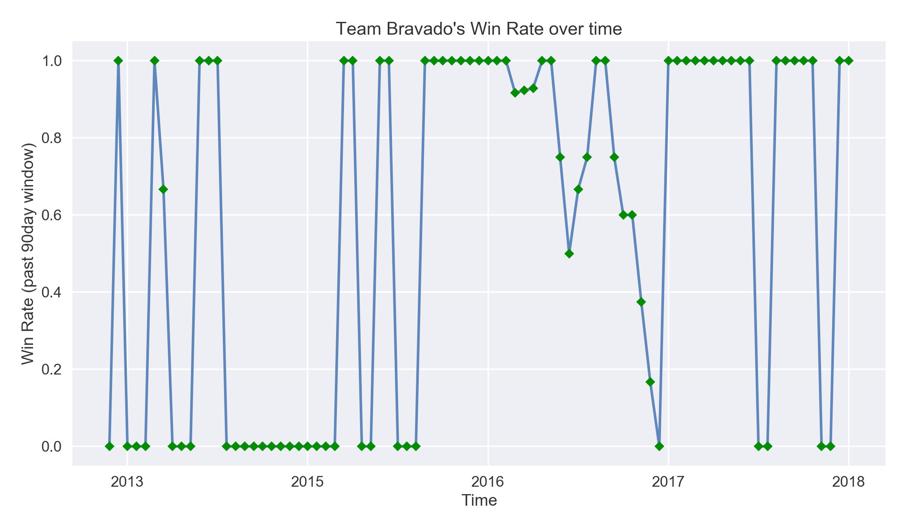

# eSports_Betting_Portfolio_Recommender

### NOTE: THIS PROJECT IS PURELY A CONCEPT.

## Motivation:
Today eSports is one of the fastest growing industries. As of [early 2017 the industry was estimated as worth $689M with a compound annual growth rate of 40%](https://newzoo.com/insights/articles/esports-revenues-will-reach-696-million-in-2017/). And with this growth, eSports betting markets have been emerging and expanding. The goal of this project is to explore the possibility of building a prediction model that would have a better accuracy of predicting match outcomes than the odds of a betting market (beating their odds). With this in mind, I chose to look at predicting CS:GO matches.

## The Goal: Building a profitable model.
- In sports betting the ultimate goal is to beat the odds of a particular betting market. Not only do the odds represent the payout one would receive in the event of a successful match but they also represent the particular betting market's probability prediction of whether a particular team will win a match. With this concept in mind, the market's odds essentially represent the market's own predictive strength. You could look at a market's odds as the probability outcomes of their own classification models. If you look at the market's odds, translate them into probabilities and create classification predictions off these probabilities and compare with the known outcomes of those matches (target variable) you then get the baseline accuracy. If you build a model that has a higher accuracy than this baseline accuracy, then you now have a profitable model. This is the goal.

## Odds 101: Decimal Odds:

### How to interpret decimal odds:
- In the above example, team FaZe has 1.32 odds. This means that for every $1 you bet, if you win you will be paid $0.32. So the team with the lower decimal odds means that the market is predicting that team has a higher chance of winning, and as such, the risk is smaller and the payout is smaller to reflect this risk. More risk, more reward is the idea here.
### Converting decimal odds into percentages:
#### Probability = 1 / (Decimal Odds)
In this case the Market says FaZe has a 75% of winning and Mousesports has a 32% chance of winning. You probably noticed these percents don't add to 100%. The difference in these percentages is called the Betting Margin (See below).

### Tradition odds definition: How it differs from Betting Market Odds
- Traditional Odds = (Probability of event happening) / (Probability of event not happening). You can then workout with algebra what the probability is from traditional odds. These probabilities will add up to 1. 
    NOTE: When dealing with decimal odds, the probability is P = 1/(decimal odds).
- Betting Market Odds are the same as traditional odds with the exception that the betting market will slightly raise the probabilities of each team winning, which translates to a lower payout from the odds. This is the Betting Margin. It is a built in way the betting market protects itself from having to payout higher amounts to winning bets. So in order to calculate our estimate of the true probability predictions of a betting market you would then add back this difference/2 for each team. This difference would be the probabilities of the betting market of each team winning added up and subtracting 1.

## Data collection: Web Scraping (2 web sources)
- History of CS:GO matches from 2012 to present(2018 Jan)
- Team statistics/ratings from 90days in the past of a match taking place.
- Market odds of a match durring this particular date.
Problem: All of the scaped web sources had data populated from a java script. This makes it more challenging to pull information from a website.
Solution: I used Selenium. Selenium is an automated web browser where you can scrape whatever text shows up on a webpage since it is rendered within this automated broswer rather than just existing within a pages HTML code.
### Link to web scraping gist

## Feature Engineering: Calculating new predictive variables
- Team and Opponent Schedule Strength ratios (defined as team_ss and opp_ss in dataframe). Schedule strength ratio says for a given team in a match, what was the total ammount of wins all of their past opponents had / the total amount of games their past opponents played. This ratio was calculated in a past 60 day window.
- Team and Opponent win ratios. This metric captures a team's win streak in a given time window (60 days). Win ratio = (total past wins in the past 60 days) / (total past games in the past 60 days)

## Predictive strength of our features:

### Main takeaways:
- The most highly correlated features (variables) to correctly predicting the target (winner) are not suprisingly, team_odds and opp_odds. Next biggest correlations are KD_diff_team, KD_diff_opp (difference in Kills/Deaths in a time window) and ranking_opp and ranking_team (This is a proprietary ranking metric that HLTV, a csgo stats website, built to rank teams for a given time frame, in this case the past 90 days).
- All time/date features are completely uncorrelated with the target winner. Also the ranking_version is either 1 or 2. HLTV updated their rating metric to a second version in early 2016, so this feauture was set to keep track of which ranking version was used durring the time a particular match took place.

## Model selection: And Why.
### Boosted Forest. This model was chosen based on it's history of performing particularly well when all you're concerned with is predictive power.
- SkLearn's Gradient Boosting Classifier
- SkLearn's AdaBoost Classifer
- catboost's Cat Boost Classifier (highest accuracy)
### Additional Models
- SkLearn's Multilayer Perceptron Neural Net
### Boosted forest 101. 
A Boosted Forest is an ensemble model of decision trees, meaning it's predictions are an aggregate decision of many decision trees. What makes a boosted forest particularly interesting is that each tree makes a prediction off of the residual errors of the tree before it. Put another way, this means, that each consequutive tree makes a prediction off of the known errors of the previous tree. What this means for an overall model is that with each additional tree in the boosted forest ensemble, it will be easier and easier for the next tree to predict correctly because the error of each previous trees predictions are gradually decreased.

## The Betting Market's Baseline Accuracy:
-  70% Accuracy is the baseline. This is calculated by saying you're going to be making predicting whether a team in a match wins or looses based solely off of the market's probability of the team winning. In other words, predict which team will win based off of which team has the higher odds of winning (lower decimal odds). Then compare the predictions to the known value of the historical outcomes, target data.
- If our model has an accuracy that is higher than this baseline, then it is profitable. This is the ultimate goal for this problem.

### Results:
- Our model's accuracy is exactly at the baseline. So unfortunately, this model is not currently profitable.
- However, with odds features completely removed we still have a test accuracy of 67.6%. That is not bad, just 2.5% below being profitable. So we're on the right track.

### Thoughts:
If you take a look at the feature correlation matrix, we can see that every predictive feature of a team winning is also correlated to team_odds and opp_odds. One hypothesis is that this particular betting market must be factoring in all of these other features into their own model to create their probability predictions and ultimately odds in the first place.
- In other words, it's quite possible that this feature space isn't including any new information that the betting market doesn't already have to make their predictions.

## Testing betting stategies:
Once you have a model who's accuracy is hopefully above the market's baseline accuracy, then the next question is what is the most profitable betting strategy. Multiple betting strategies were explored and profit outcomes were confirmed from running simulations on our collected data.

### 1. Threshold strategy:
In this stragegy the user will place a bet on a team when ever the model predicts the probability of that team winning is above a pre-defined threshold, say 60%.

### 2. Beating the odds #1:
This strategy says, assuming you are above baseline accuracy, you should place a bet on the team where your model's probability of that team winning is higher than the market's probability. What this is essentially saying is that, since your model has a higher accuracy than the market's, the team where your model's probability is higher is the 'under-valued' team. It's undervalued because odds are calculated from these probabilites and represent the pay out. For example, if the market says 'SK Gaming' has a 35% chance of winning but your model says 'SK Gaming' has a 45% of winning, then the payout would be higher than the risk you are taking on placing money that bet. Odds ~= (Probability of winning / Probability of loosing), in this case 35% --> 35/65 or in Decimal form: 1/0.35 = 2.85 meaning you get $1.85 for a $1 put on the bet vs. our model's prediction of 45% --> 45/55 or in Decimal form: 1/0.45 = 2.22 meaning you'd get $1.22 for $1 put on the bet. We're saying the risk is worth $2.22, the market is saying the risk is higher, so the payout is more and we're getting a good deal on that particular bet.

### 3. Beating the odds #2:
This strategy says, only place a bet on a team where our model says the team will win (it's probability of winning is above 50% from our model) and where the probability predicted from our model is greater than the market's probability.

### 4. Beating the odds #3:
This strategy says, if the difference between our model's probability and the market's probability of a team winning is greater than a certain fixed amount, then we will place the bet. The idea here was that if the model's difference in probability from the market's probability of a team winning is very small, then the team isn't very undervalued and we shouldn't be placing a bet. (Strategy # 4 fixes this risk problem).

### 5. Beating the odds #4:
This strategy takes allocated a betting budget accross multiple matches and the amount of money on each bet is proportional to the amount at which a team is undervalued (the extent at which our model's probabilities of a team winning is greater than the betting market's probability of that team winning).
- This was the most profitable strategy and the one used in this betting recommender algorithm.

## The User Experience (The data Product):
- This algorithm scraps matches for a given day, then provides a day's betting portfolio of what teams to bet on and how much money to put on each team based on a user's entered budget.
### URL for web app ***

## Simulating a production environment:
- Why? As time goes on, the distribution of data can change. What this means is that if your model is predicting well today, it's very possible (and likely) that the distribution of features it uses to predict could change over time making the predictions of your model less accurate over time. An example could be that a certain team that used to always loose gains star players and starts get a winning streak. Or perhaps the market odds you're model uses as a feature begin to change as the company providing these odds improves their own internal model's accuracy.
- Every time this betting algorithm is run to predict on more bets, new data is added to each respective MongoDB database where a model can be retrained and then used freshly trained on new bets.

## Conclusion:
- Time is very important. Team's win steaks rise and fall over time and this information was not captured in this model. To demonstrate, below is an example of a team with a high win rate volitility (win rate = #wins / # games played within a 90day look back window):

- Collect more non-traditional features. Features (information) that the betting market's are most likely not taking into account when making their own prediction models.

## Next Steps:
- Add player level stats
- Re-structure data into time based model. Experiement with LSTM (Long Short Term Memory) neural net.
- Record multiple odds markets' odds to capture any additional information other betting markets are looking at.
- Collect fan comments about matches before they occur and perform Natural Language Processing.

## Tech stack used:
- Pymongo: a python client to connect to MongoDB database
- Selenium: automated web broswer tool. Used for scraping.
- Numpy: Python's matrix manipulation library
- Pandas : Python's answer to R's Dataframe datatype.
- Seaborn & Matplotlib: Python's popular graphing libraries.
- catboost: Yandex's opensource library for their state of the art boosted forest models.
- SkLearn : Python's popular Machine learning model and toolkit library.
